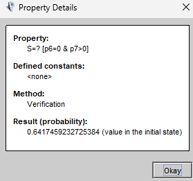

# Operational tasks

Considerando il modulo msg in prism (slide 26, pacchetto "08 - Stochastic Analysis")

```prism
ctmc
module msg
s : [0..3] init 0;
[] s=0 -> 1 : (s’=1);
[] s=1 -> 0.1 : (s’=1) +
0.1 : (s’=2) +
10 : (s’=3);
[] s=2 -> 100 : (s’=0);
[] s=3 -> 1 : (s’=3);
endmodule
```

Eseguendo le query da prism si ottengono i seguenti risultati:

- P=? [ (true) U<=1 (s=3) ] --> 0.5877
- S=? [! s=3] --> 0

.png)

.png)

Calcolando la probabilità che il sistema raggiunga lo stato 3 entro un certo numero di step k, si ottiene:
- P=? [(true) U<=k (s=3)], where k ∈ [0, 10.0] with step 0.1

.png)

Considerando il modello RW in prism (slide 29, pacchetto "08 - Stochastic Analysis")

```prism
ctmc
const int N = 20;
module RW
p1 : [0..N] init N;
p2 : [0..N] init 0;
p3 : [0..N] init 0;
p4 : [0..N] init 0;
p5 : [0..N] init 1;
p6 : [0..N] init 0;
p7 : [0..N] init 0;
[t1] p1>0 & p2<N -> 1 : (p1’=p1-1)&(p2’=p2+1);
[t2] p2>0 & p3<N -> 200000 : (p2’=p2-1) & (p3’=p3+1);
[t3] p2>0 & p4<N -> 100000 : (p2’=p2-1) & (p4’=p4+1);
[t4] p3>0 & p5>0 & p6<N -> 100000 : (p3’=p3-1) & (p6’=p6+1);
[t5] p4>0 & p5>0 & p6=0 & p7<N -> 100000 : (p4’=p4-1) & (p5’=p5-1) & (p7’=p7+1);
[t6] p6>0 & p1<N -> p6*1 : (p6’=p6-1) & (p1’=p1+1);
[t7] p7>0 & p5<N & p1<N -> 0.5 : (p7’=p7-1) & (p1’=p1+1) & (p5’=p5+1);
endmodule
```

Chiedendo la probabilità che almeno un token abbia raggiunto p6, considerando k step:

```prism
P=? [(true) U<=k (p6>0)]
```

Si è ottenuto questo risultato:

.png)
.png)

Considerando l'approccio Scala di questo laboratorio, eseguendo il codice in 
"StochasticChannelExperiment" si ottiene il seguente risultato:

.png)

# R&D Task: PRISM
Ho effettuato alcuni esperimenti per verificare la probabilità di alcuni eventi:

- probabilità che i writers accedano con successo a una risorsa in un tempo k:

```prism
P=? [(true) U<=k (p7>0)]
```

Risultato ottenuto:


- probabilità che i readers accedano con successo a una risorsa in un tempo k:

```prism
P=? [(true) U<=k (p6>2)]
```

Risultato ottenuto:


- Probabilità che almeno un reader diventi attivo entro il tempo k

```prism
P=? [ F<=k (p6>0) ]
```

Risultato ottenuto:


- Probabilità che almeno un writer diventi attivo entro il tempo k

```prism
P=? [ F<=k (p7>0) ]
```

Risultato ottenuto:


- Probabilità steady-state che il sistema non abbia nessun reader nè writer attivo 

```prism
S=? [p6=0 & p7=0]
```

Risultato ottenuto:


- Probabilità steady-state che il sistema abbia readers attivi ma nessun writer attivo

```prism
S=? [p6>0 & p7=0]
```

Risultato ottenuto:


- Probabilità steady-state che il sistema abbia writers attivi ma nessun reader attivo

```prism
S=? [p6=0 & p7>0]
```

Risultato ottenuto:



Invertendo il rate delle transizioni t2 e t3:

```prism
[t2] p2>0 & p3<N -> 100000 : (p2'=p2-1) & (p3'=p3+1); // prima 200000
[t3] p2>0 & p4<N -> 200000 : (p2'=p2-1) & (p4'=p4+1); // prima 100000
```

La probabilità cambia enormemente, mostrando che la probabilità steady-state di readers attivi e nessun writer si riduce drasticamente:


L'opposto cosa accade nel problema contrario, la probabilità steady-state di writers attivi e nessun reader aumenta drasticamente:


Le due probabilità sono ovviamente complementari, in quanto misurano problemi opposti (come anche nel caso precedente
dove i rate erano invertiti).